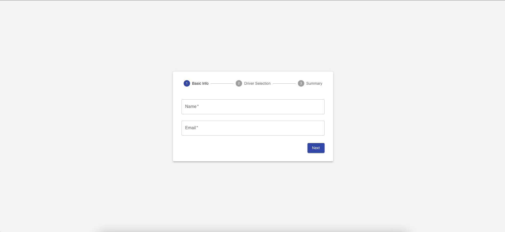
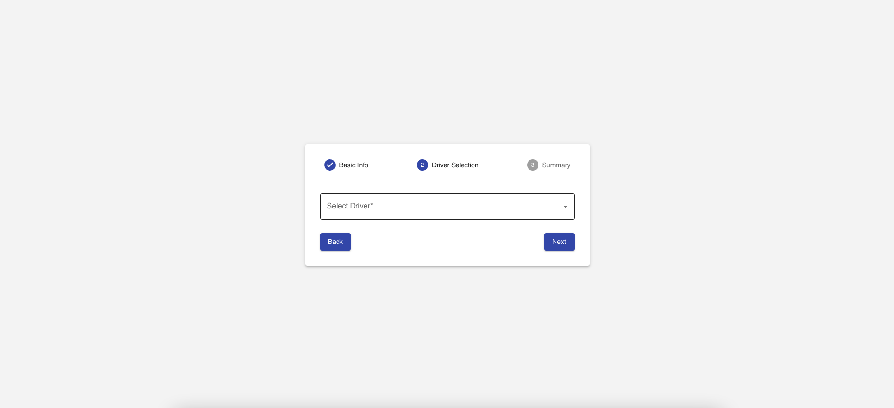
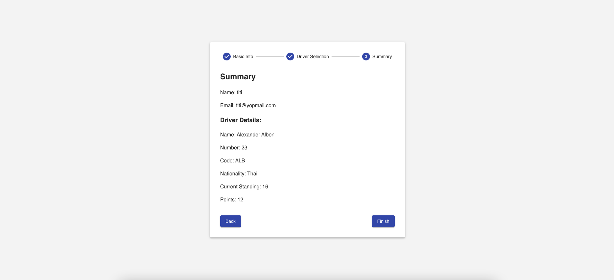

# F1 Fan Profile

## Table of Contents

1. [Project Title and Description](#Project-Title-and-Description)
2. [Installation and Setup Instructions](#installation-and-Setup-Instructions)
3. [Usage Instructions](#Usage-Instructions)
4. [Available Scripts](#Available-Scripts)
5. [Features](#features)
6. [Technical Stack](#Technical-Stack)
7. [Screenshots](#Screenshots)
8. [Future Improvements](#Future-Improvements)
9. [License](#license)
10. [Contact Information](#Contact-Information)

## Project Title and Description

Project Title: F1 Fan Profile

Project Description:
This is a multi-step form application built with React.js that allows users to enter their details and select their favorite F1 driver. It fetches real-time data from the API to display relevant statistics and rankings, providing an interactive and engaging user experience.

## Example Usage

Enter your name and email in Step 1.
Select your favorite F1 driver from the dynamically loaded list in Step 2.
View a summary of your details and the selected driver's statistics in Step 3.

## Features

1. [Step 1: User Information Form](#Step-1-User-Information-Form): Collect user's basic information (name, email)
2. [Step 2 Driver Selection](#Step-2-Driver-Selection): Allow user to select an F1 driver from API data
3. [Step 3 Summary Page](#Step-3-Summary-Page)`: Display a summary page showing user information and driver details
4. State Management: Implemented using Redux Toolkit
5. API Integration: Fetch driver data and standings
6. Drivers: https://api.jolpi.ca/ergast/f1/2024/drivers/
7. Standings: https://api.jolpi.ca/ergast/f1/2024/driverstandings/
8. Loading: Clear indicators during data fetching to enhance usability.
9. Error Handling: Graceful error messages with retry options for improved user experience.
10. Step Navigation: Users can freely navigate between form steps without data loss.
11. Progress Tracker: Visual progress indicator to keep users informed of their current step.
12. Driver Details: Display key stats including driver name, number, code, Current Standing and points.

## Installation and Setup Instructions

Prerequisites
Ensure you have the following installed:
Node.js (>= 16)
npm or yarn

Clone the repository

### `git clone https://github.com/yourusername/f1-fan-profile.git`

### `cd f1-fan-profile`

Install dependencies

### `npm install # or yarn`

The application will be available at http://localhost:3000/

## Usage Instructions

How to Run

To start the application locally, use the following command:

### `npm start`

Runs the app in the development mode.\
Open [http://localhost:3000](http://localhost:3000) to view it in your browser.

The page will reload when you make changes.\
You may also see any lint errors in the console.

## Available Scripts

### `npm run test`

Launches the test runner in the interactive watch mode.\
See the section about [running tests](https://facebook.github.io/create-react-app/docs/running-tests) for more information.

### `npm run build`

Builds the app for production to the `build` folder.\
It correctly bundles React in production mode and optimizes the build for the best performance.

The build is minified and the filenames include the hashes.\
Your app is ready to be deployed!

See the section about [deployment](https://facebook.github.io/create-react-app/docs/deployment) for more information.

## Technical Stack

1. Frontend: React.js
2. State Management: Redux Toolkit
3. Styling: Material UI (@mui/material), Framer Motion (for animations)
4. Routing: React Router DOM
5. HTTP Requests: Axios
6. TypeScript Integration: Ensures code reliability and maintainability.
7. Form Validation: Real-time validation for user inputs.
8. Smooth Transitions: Framer Motion animations for a polished UX.
9. Mobile-Friendly Design: Fully responsive layout adaptable to various devices.

## Screenshots

### Step 1 User Information Form

### Step 2 Driver Selection

### Step 3 Summary Page

## License

This project is open-source under the MIT License.

## Contact Information

For any issues or contributions, please contact:

1. gitHub : yourusername
2. Email : your.email@example.com
